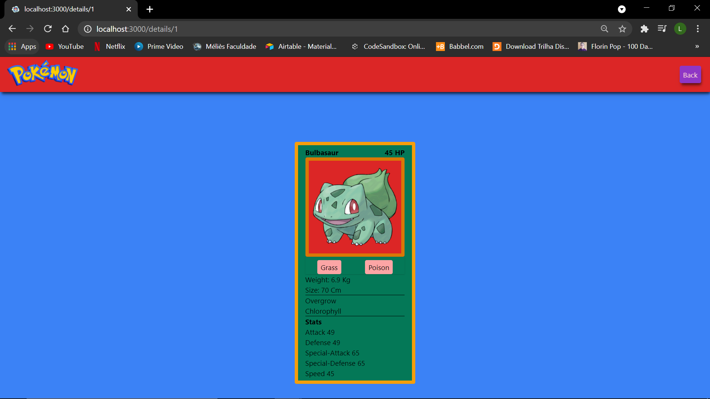
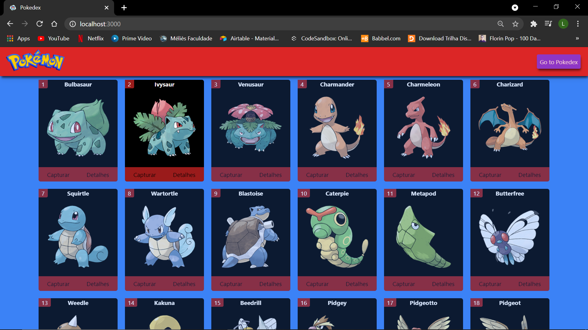
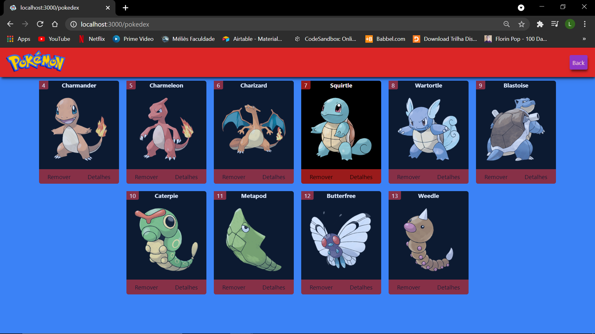

# Pokedex
This project is a Pokemon website developed in Next.JS. The website was made using <a href="https://tailwindcss.com/">tailwindcss</a>, axios and Context, i love every second work in this project if you have something to add feel free to open a request.

# How to use it
1 - you need to have NodeJs 10.16 our higher and npm.
 
2 - npx create-next-app my-app to create the application.
 
cd my-app to enter in the directory.
 
npm run dev to start the application.
 
3 - start to code in app.js.
 
Any help you need to start coding javaScript in Next.js <a href="https://nextjs.org/docs/getting-started">Next.JS</a>
 

 

